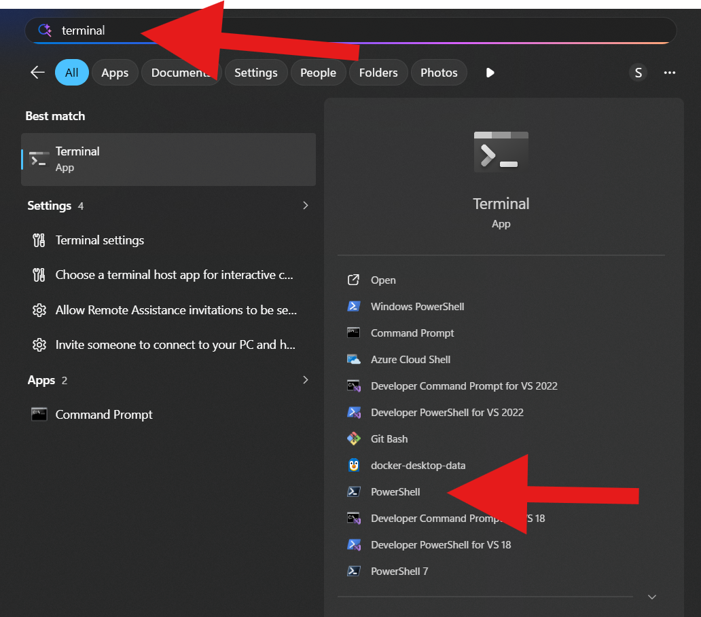

# Maester workshop - setup

This is part of the Maester workshop, check it out [here](./README.md#maester-workshop).

## 1. Open a PowerShell terminal

Open a new PowerShell (>= 7.5) terminal window.

This app is called `Terminal` and is installed on every windows 11 machine. Make sure you click `PowerShell` and not `Windows PowerShell`!



<details>

<summary>Mac Users</summary>

### Install PowerShell

Follow the steps at [microsoft learn](https://learn.microsoft.com/en-us/powershell/scripting/install/install-powershell-on-macos?view=powershell-7.6) to install the latest version of PowerShell

</details>

## 2. Install Maester

Copy the following command and paste it in your terminal.

This command will install the PowerShell module from the repository.

```ps
Install-Module Maester
```

You might be asked to allow installing modules from a repository, answer this question with `Yes`

## 3. Setup folder

Go to a specific folder in your terminal.

Create a new folder:

```ps
mkdir maester
```

Enter the new folder:

```ps
cd maester
```

## 4. Install built-in tests

Install all the tests that Maester provides:

```ps
Install-MaesterTests
```

<details>

<summary>Install tests explained</summary>

Maester has a lot of tests built-in, all tests are written in PowerShell. If you ever worked with PowerShell the tests should be fairly easy to read.

> [!WARNING]
> The following command includes a windows formatted filepath and may not work on mac. It also counts on this exact test to still be available.

View a built-in test:

```ps
cat .\cis\Test-MtCisThirdPartyFileSharing.Tests.ps1
```

Or the exact source:

```ps
Describe "CIS" -Tag "Security", "CIS", "CIS M365 v5.0.0" {
    It "CIS.M365.8.1.1: Ensure external file sharing in Teams is enabled for only approved cloud storage services" -Tag "CIS.M365.8.1.1", "CIS E3 Level 2" {

        $result = Test-MtCisThirdPartyFileSharing

        if ($null -ne $result) {
            $result | Should -Be $true -Because "file sharing with third-party cloud services is disabled."
        }
    }
}
```

</details>

## Summary

- You opened a terminal
- Installed the Maester module
- Created a folder called `maester` in your default location
- Installed the built-in tests

## Next

Go to the [next step](./step-2-running-maester.md) or [the overview](./README.md#maester-workshop).
