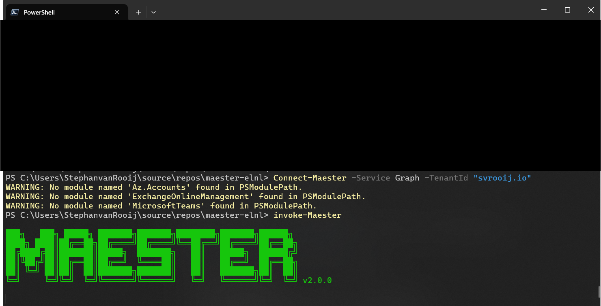
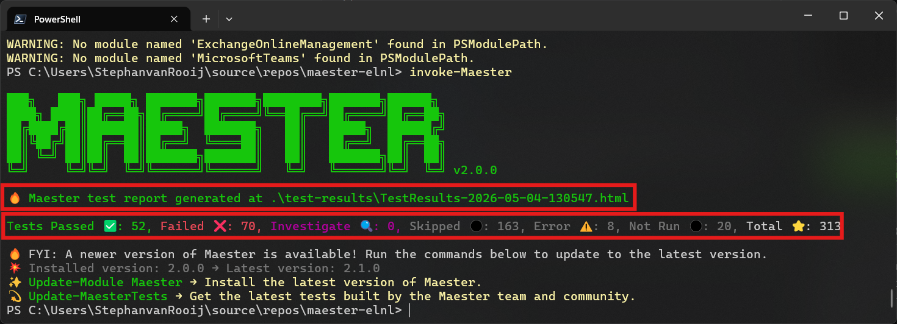
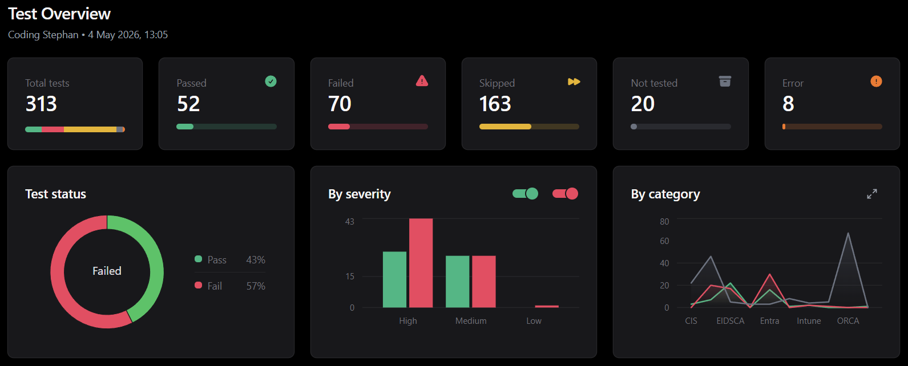
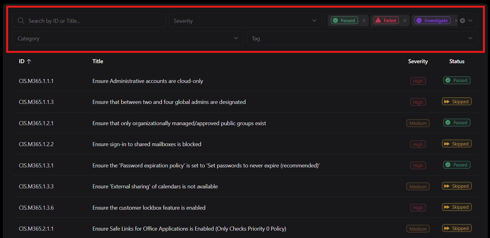
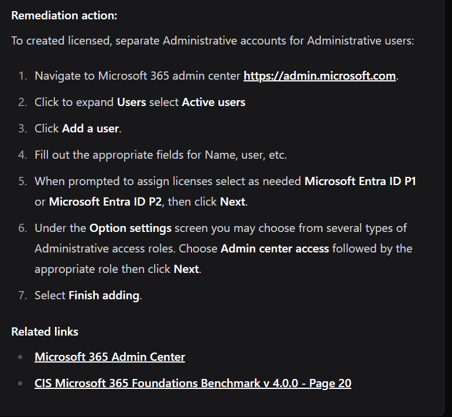

# Maester workshop - Running Maester

This is part of the [Maester workshop](./README.md#maester-workshop) or check the [previous step](./step-1-setup.md).

## 1. Connect to your tenant

To be able to run Maester you will have to connect to your tenant. We will be using the default interactive login, you can [explore](https://maester.dev/docs/commands/Connect-Maester) additional methods yourself.

```ps
Connect-Maester
```

This command will ask you to login and will then ask you to consent to the requested permissions. You'll need a **global admin** account to consent to this app.

## 2. Run Maester for the first time

With the [Invoke-Maester](https://maester.dev/docs/commands/Invoke-Maester) command you can run all your maester tests. You're now going to execute it with all the default parameters. Make sure you're still in the `maester` folder you created in the previous step.

```ps1
Invoke-Maester
```

It will now execute all the tests in your environment, this may take some time.



## 3. Test reports

When you execute Maester with the default parameters it will use the tests from the current folder. The test reports will be placed in the `test-results` folder. And the html report will be opened after the tests in your default browser.

Open the `test-results` folder in explorer:

```ps
explorer .\test-results
```

This is how it looks for my *test* tenant.



### HTML Report

The html test report will automatically open in your default browser. 

Test overview:



Built-in interactive filter:



Most tests have remediation steps in the details:



## Summary

- You connected Maester to your tenant
- You got your first maester test report

## Next

Go to the [next step](./step-3-exploring-tests.md) or [the overview](./README.md#maester-workshop).