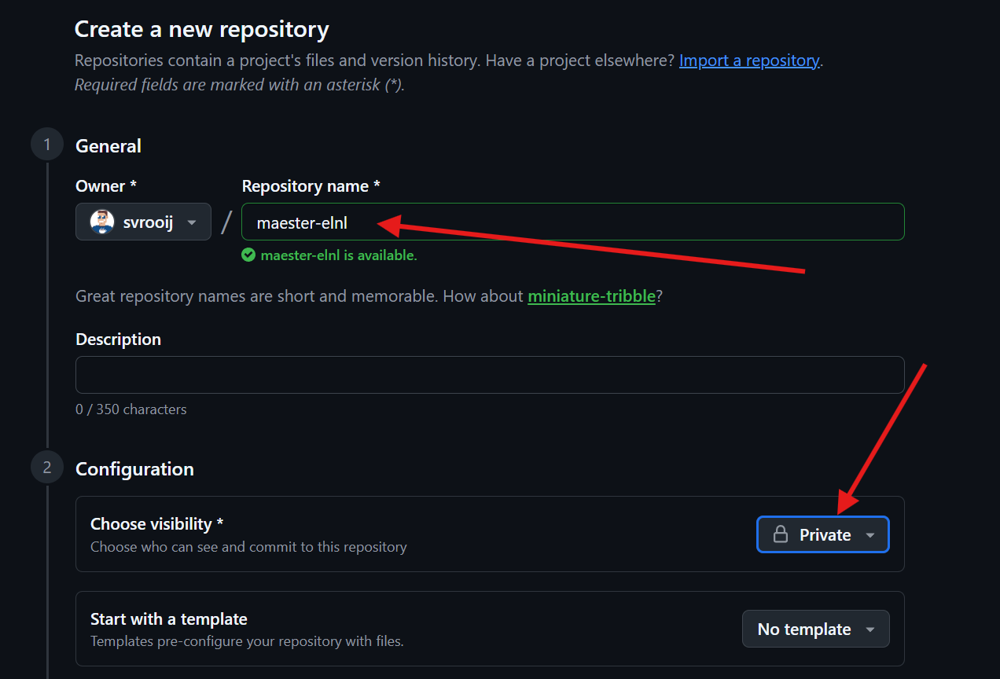
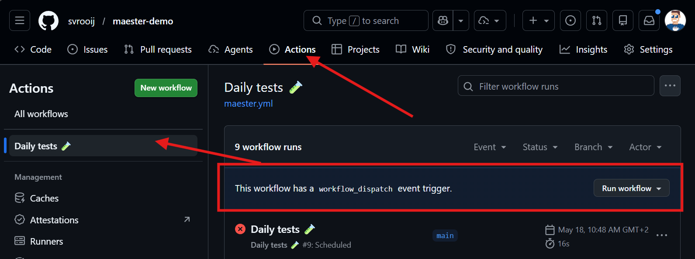

# Maester workshop - Run on Github Actions

This is part of the [Maester workshop](./README.md#maester-workshop) or check the [previous step](./step-4-custom-test.md).

This is a simplyfied version of [official docs - Maester on GitHub](https://maester.dev/docs/monitoring/github)

## Pre-requisites

We are going to run Maester on GitHub actions, every account get some minutes for free and this should be enough to run it at least daily. But you need a free [GitHub account](https://github.com/signup)

## Browser only

This lab will show you all the steps in the browser. This is definitly not the best way to interact with a GitHub repository, but it is the way that does not require any additional installation (git, vscode).

## Create a new repository

1. Go to [github.com/new](https://github.com/new) to create a new repository.
2. Pick a name like `maester-{devTenantDomain}`, for example.
3. Enter something for the description like `Automated Maester report for ...`
4. Set the visibility to `Private`!! (you don't want the report to be public by default)
5. Turn on `Add README`
6. Leave everything else default
7. Press `Create repository`



## Decent code editor (optional)

I prefer a decent code editor for all interactions with GitHub, but this is completely optional. Pick either of these options, or continue in the browser.

> [!INFO]
> If you use a code editor, the rest of the lab will expect you to know how git works, if not check out [this video](https://www.youtube.com/watch?v=i_23KUAEtUM) for a beginner tutorial of using git in Visual Studio Code.

### a. Clone the repository to your machine

If you want to edit the files on your local computer and have Visual Studio Code installed, click the `<> Code` button and click "Open with Visual Studio Code"

### b. Open a "Codespace"

GitHub also provides so called "Codespaces" in the cloud. This is a cloud hosted Visual Studio Code editor, provided to you in the browser.

## Create workflow file

1. Click the `Add file` -> `Create new file` buttons
2. Name the file `.github/workflows/maester.yml`
3. Paste the following content
4. Commit the changes

```yml
name: Daily tests 🧪

on:
  push:
    branches: ["main"]
  # Run every week on monday at 7:30 UTC (change accordingly, see https://crontab.guru/#30_7_*_*_1)
  schedule:
    - cron: "30 7 * * 1"
  # Allows to run this workflow manually from the Actions tab
  workflow_dispatch:

permissions:
      id-token: write
      contents: read

jobs:
  run-maester-tests:
    name: Maester 🔥
    runs-on: ubuntu-latest
    steps:
    - name: 🏗️ Checkout code
      uses: actions/checkout@v4
    - name: 🔥Run Maester 
      id: maester-action
      uses: maester365/maester-action@main
      with:
        client_id: ${{ secrets.AZURE_CLIENT_ID }}
        tenant_id: ${{ secrets.AZURE_TENANT_ID }}
        include_public_tests: true # Optional: Set to false if you are keeping to a certain version of tests or have your own tests
        include_private_tests: false # no other tests yet
        include_exchange: false    # Optional: Set to true if you want to include Exchange tests
        include_teams: false     # Optional: Set to true if you want to include Teams tests
        #include_tags: Maester,Security,Entra
        step_summary: true         # Optional: Set to false if you don't want a summary added to your GitHub Action run
        artifact_upload: true      # Optional: Set to false if you don't want summaries uploaded to GitHub Artifacts
        maester_version: preview  # Optional: Set to true if you want to use Measter Preview Build when running tests
        disable_telemetry: true   # Optional: Set to true If you want telemetry information not to be logged.
```

The latest version can be found at [official docs - Maester on GitHub](https://maester.dev/docs/monitoring/github).

## Fix failed first run

When you commited your changes, the workflow will start itself (on push to main triggered it). And will fail the first time! You did not create the correct app registration, granted the correct permissions and the secrets are not set yet.


## App registration

1. Open [Entra admin center](https://entra.microsoft.com/)
2. Go to `Identity` -> `Applications` -> `App registrations`
3. Create a new registration
4. Enter the name (like `Maester on GitHub`)
5. Leave the redirect url empty

### App registration permissions

1. Open the application you just created
2. Go to `API permissions` -> `Add a permission`
3. Select `Microsoft Graph` -> `Application permissions`
4. Search and add all the permissions in the list below
5. Grant admin consent for [your organisation]

- `DeviceManagementConfiguration.Read.All`
- `DeviceManagementManagedDevices.Read.All`
- `DeviceManagementRBAC.Read.All`
- `DeviceManagementServiceConfig.Read.All`
- `Directory.Read.All`
- `DirectoryRecommendations.Read.All`
- `IdentityRiskEvent.Read.All`
- `OnPremDirectorySynchronization.Read.All`
- `Policy.Read.All`
- `Policy.Read.ConditionalAccess`
- `PrivilegedAccess.Read.AzureAD`
- `Reports.Read.All`
- `ReportSettings.Read.All`
- `RoleEligibilitySchedule.Read.Directory`
- `RoleManagement.Read.All`
- `SecurityIdentitiesSensors.Read.All`
- `SecurityIdentitiesHealth.Read.All`
- `SharePointTenantSettings.Read.All`
- `ThreatHunting.Read.All`
- `UserAuthenticationMethod.Read.All`

> [!WARNING]
> Did you actually press the **Grant admin consent** button? It will show you anyway but better double check.

More info at the [official docs](https://maester.dev/docs/monitoring/github#set-up-the-github-actions-workflow)

### App registration federated credentials

1. Open the application you've created in previous steps
2. Go to `Certificates & secrets`
3. Select `Federated credentials` and click `Add credential`
4. For `federated credential scenario` select `GitHub Actions deploying Azure Resource`
5. Enter the following details:
    - Organization: Your username (or organization in case of an organization account)
    - Repository: Name of your repo, [step 1](#create-a-new-repository)
    - Entity type: `Branch`
    - GitHub branch name: `main` (this is de default, if you followed the basic steps)
    - Credential details -> name: `maester-github` (this is just for reference in the portal, not used in authentication)

## Configure GitHub Actions Secrets

1. Open your repository in the browser and go to settings.
2. Go to `Security` -> `Secrets and variables` -> `Actions`
3. Add a new secret called `AZURE_TENANT_ID`: with the ID of you Entra tenant
4. Add a new secret called `AZURE_CLIENT_ID`: with the `Application (client) ID` of the app registration you just created.

## Run the workflow on demand

If you created the workflow exactly as the sample above, there should be a `Run workflow` button under your new workflow.
Since we have now configured all the secrets, the action should now be able to run automatically.



## Summary

If you followed along, you should now have:

- A GitHub repository with a Maester workflow configured
- An app registration with read permissions to your environment, with admin consent granted
- Maester will run against your environment every monday at 7:30

## Next

Go to the [next step](./step-6-publish-report-static-web-app.md) or [the overview](./README.md#maester-workshop).
