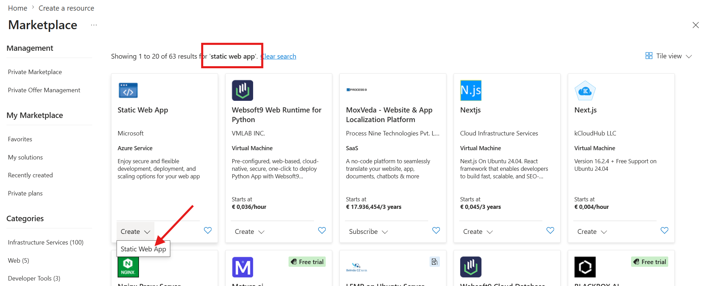
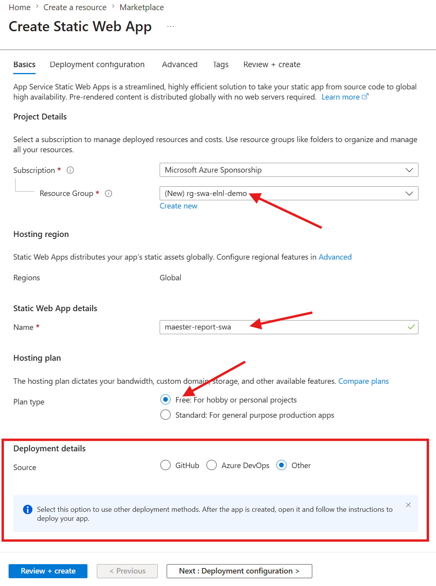

# Maester workshop - Publish report to Azure Static Web Apps

This is part of the [Maester workshop](./README.md#maester-workshop) this step depends upon the [**previous step**](./step-5-run-on-github.md) so make sure you did not skip that.

## Pre-requisites

- [**previous step**](./step-5-run-on-github.md)!!
- Azure subscription
- Permission to create an **Azure static web app**

## Create Azure Static Web App

1. Go to the [Azure Portal](https://portal.azure.com)
2. Click `Create a resource`
3. Search for `static web app`
4. Under `Static Web App` click the create button.
5. Create or select a resource group
6. Pick a name for your static web app, like `maester-report-swa`
7. **Hosting plan** select `Free`
8. **Deployment plan** select `Other`!
9. Click the advanced tab, if you want to change the default region to `West EU`
10. Click review and create
11. Wait a few seconds and click the `Create` button





## Configure access on Static Web App

1. Open the just created static web app
2. Click `Access Control (IAM)` and `Role assignments`
3. Click `Add` and `Add role assignment`
4. Click `Privileged administrator roles`
5. Select `Contributor` and click next (there is no built-in role with the correct permissions, you could create a custom role if you want)
6. Click the `Select members` button, while Assign access to still shows `User, Group, or service principal`
7. Search for `Maester` and search for the app you've created in the [previous lab](./step-5-run-on-github.md#app-registration)
8. Click the correct application, and click Select
9. Click Review + Assign, and press it again after verifying everything
10. Copy the name of the Static web app!

## Configure the name as a secret

1. Open your repository in the browser and go to settings.
2. Go to `Security` -> `Secrets and variables` -> `Actions`
3. Add a new secret called `SWA_NAME`: with the name of the Azure Static Web app you just copied.

## Add static web app config

1. Click the `Add file` -> `Create new file` buttons
2. Name the file `swa-config/staticwebapp.config.json`
3. Paste the following content
4. Commit the changes

```json
{
  "routes": [
    
    {
      "route": "/.auth/login/github",
      "statusCode": 404
    },
    {
      "route": "/*",
      "allowedRoles": ["admin"]
    }
  ],
  "responseOverrides": {
    "401": {
      "statusCode": 302,
      "redirect": "/.auth/login/aad"
    }
  }
}
```

This static web app config is to force everybody to have the **admin** role and to redirect all unauthorized requests to Entra ID (here still called aad).

## Edit the workflow

1. Browse for your workflow file `.github/workflows/maester.yml`
2. Press the edit button, (with the pencil)
3. Append the following content
4. Commit the changes

```yml
    - name: 📦 Move files
      shell: pwsh
      run: |
        # Create a directory dist if it doesn't exist
        if (-not (Test-Path -Path "dist")) {
          New-Item -ItemType Directory -Path "dist"
        }
        # Copy files in test-results to dist
        Copy-Item -Path "test-results/*" -Destination "dist" -Recurse -Force
        # Rename test-results.html to index.html
        if (Test-Path -Path "dist/test-results.html") {
          Rename-Item -Path "dist/test-results.html" -NewName "index.html"
        }
    - name: 🚀 Deploy results to SWA
      uses: svrooij/azure-static-web-app-deploy-action@main
      with:
        tenant_id: ${{ secrets.AZURE_TENANT_ID }}                # Required for federated credentials
        client_id: ${{ secrets.AZURE_CLIENT_ID }}                # Required for federated credentials
        static_web_app_name: ${{ secrets.SWA_NAME }}             # Required for federated credentials
        app_location: 'dist'                                     # Optional, default '.'
        api_location: ''                                         # Optional, default 'api'
        swa_environment: 'production'                            # Optional, default 'production'
        swa_config_directory: 'swa-config'
```

## Invite `admin` users

As soon as you changed the workflow file the workflow will run again, and it will now publish the Maester result to this new Azure Static Web App. Let it finish first. Your report needs to be deploy at least once before you can invite users.

1. Wait for your report to be deployed!
2. Open the [Azure Portal](https://portal.azure.com)
3. Click `Settings` -> `Role management`
4. Click `Invite`
5. Fill in these details:
    - Authentication provider: Azure Active Directory (😂)
    - Email address: Your email (or your collegues)
    - Domain: Leave the default (since you did not configure a custom domain yet)
    - Role: `admin` (this is the role from the config above)
    - Invitation expiration: `1` (default)
6. Click generate
7. Have the user (you or your collegue) click the Invite link
8. Repeat for other users

## Summary

- Maester report published to Azure Static Web App each monday at 7:30
- Invited one or more users to access the report
- No unauthorized access to your Maester report

## Next

This was the Maester lab during Experts Live Netherlands, go back to [the overview](./README.md#maester-workshop).
